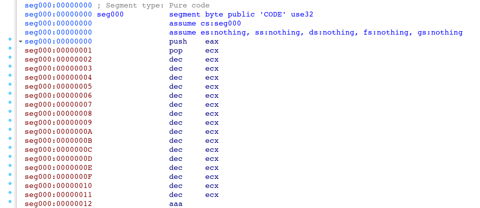

# Analysis of 2 shellcodes using miasm framework

> Note: the shellcodes are in the zip folder protected by the password `infected`.

If we check the start of the content of `shellcode1.bin`, we see it's seems to be an alphanumeric shellcode:

```sh
$ hexyl shellcode1.bin | head
┌────────┬─────────────────────────┬─────────────────────────┬────────┬────────┐
│00000000│ 50 59 49 49 49 49 49 49 ┊ 49 49 49 49 49 49 49 49 │PYIIIIII┊IIIIIIII│
│00000010│ 49 49 37 51 5a 6a 41 58 ┊ 50 30 41 30 41 6b 41 41 │II7QZjAX┊P0A0AkAA│
│00000020│ 51 32 41 42 32 42 42 30 ┊ 42 42 41 42 58 50 38 41 │Q2AB2BB0┊BBABXP8A│
│00000030│ 42 75 4a 49 62 78 6a 4b ┊ 64 58 50 5a 6b 39 6e 36 │BuJIbxjK┊dXPZk9n6│
│00000040│ 6c 49 4b 67 4b 30 65 6e ┊ 7a 49 42 54 46 6b 6c 79 │lIKgK0en┊zIBTFkly│
│00000050│ 7a 4b 77 73 77 70 77 70 ┊ 4c 6c 66 54 57 6c 4f 5a │zKwswpwp┊LlfTWlOZ│
│00000060│ 39 72 6b 4a 6b 4f 59 42 ┊ 5a 63 48 68 58 63 59 6f │9rkJkOYB┊ZcHhXcYo│
│00000070│ 59 6f 4b 4f 7a 55 76 77 ┊ 45 4f 67 6c 77 6c 43 72 │YoKOzUvw┊EOglwlCr│
│00000080│ 73 79 4e 75 7a 59 31 64 ┊ 52 53 73 42 75 4c 47 6c │syNuzY1d┊RSsBuLGl│
```

It's probably a technique to make the payload more portable and resilient to filters/sanitization. Let's open `shellcode1.bin` in IDA as x86 (32-bit):

 

```as
push    eax
pop     ecx
dec     ecx
dec     ecx
dec     ecx
dec     ecx
dec     ecx
dec     ecx
dec     ecx
dec     ecx
dec     ecx
dec     ecx
dec     ecx
dec     ecx
dec     ecx
dec     ecx
dec     ecx
dec     ecx
aaa
push    ecx
pop     edx
push    41h ; 'A'
pop     eax
push    eax
xor     [ecx+30h], al
```

We wanna know what `ecx+0x30` points to. We can use `miasm` framework symbolic execution for retrieving the equation representing the value. The easiest way to use miasm not worrying about dependencies is to use the [docker image](https://github.com/serpilliere/miasm-docker): `$ docker run -it miasm/base bash`.

We can use the docker `-v` (volume) option to map a local directory to a container's. 

We can write a script to generate the graph of the intermediate representation, as well as perform symbolic execution, and see the equation of ECX.

```python
import sys

from miasm2.analysis.machine import Machine
from miasm2.core.bin_stream import bin_stream_str
from miasm2.ir.symbexec import symbexec

bs = bin_stream_str(open(sys.argv[1]).read())

machine = Machine("x86_32")

dis_engine, ira = machine.dis_engine, machine.ira

mdis = dis_engine(bs)

mdis.dont_dis = [0x1C]			# offset instruction after 		xor     [ecx+30h], al

block = mdis.dis_block(0)

ir_arch = ira(mdis.symbol_pool)

# Translate asembly blcok to IR
ir_arch.add_block(block)

# Save Intermediate Representation graph
open('ir_graph.dot', 'w').write(ir_arch.graph.dot())

# Symbolic execution
sb = symbexec(ir_arch, machine.mn.regs.regs_init)

irdst = sb.emul_ir_blocs(ir_arch, 0)

print 'ECX =', sb.symbols[machine.mn.regs.ECX]
``` 

The graph of the intermediate representation is as follow:


We got the equation of ECX:

```
ECX = EAX_init + 0xFFFFFFF0
```

---

```
/usr/local/lib/python2.7/dist-packages/miasm2/ir/symbexec.py:609: UserWarning: Deprecated API: use SymbolicExecutionEngine
  warnings.warn("Deprecated API: use SymbolicExecutionEngine")
/usr/local/lib/python2.7/dist-packages/miasm2/ir/symbexec.py:551: UserWarning: DEPRECATION WARNING: use "emul_ir_blocks(self, addr, lbl_stop=None, step=False):" instead of emul_ir_blocs
  warnings.warn('DEPRECATION WARNING: use "emul_ir_blocks(self, addr, lbl_stop=None, step=False):" instead of emul_ir_blocs')
ECX = EAX_init + 0xFFFFFFF0
```

We got some deprecation warnings. While I didn't spent any time on the first one, changing the second one changed the result. I looks that the developers from CEA wrote "bloc" in most function names before changing it, and it acts as if `emul_ir_blocks` was reimplemented differently.


> For this project, I followed along miasm blog to help myself with the syntax etc.